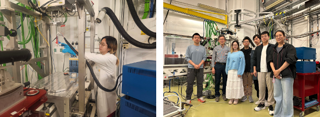

<!--more-->

During the reporting period, Prof. Yang REN led local undergraduate students including Ms. YEUNG Yeuk Yee and Mr. REN Yanhao, together with Ph.D. students, to conduct in-situ synchrotron X-ray absorption spectroscopy experiments at the SOLEIL Synchrotron in France. The experiment focused on tracking the structural and electronic changes of high-nickel ternary cathode materials during electrochemical cycling. Through direct participation in sample preparation, in-situ cell testing, beamline operation, data collection and preliminary analysis, the local students gained hands-on experience in synchrotron X-ray science and advanced battery materials research. This overseas training provided valuable exposure to a world-class large-scale research facility and international research environment, strengthening the students' practical research skills, scientific confidence, and understanding of energy materials physics.

