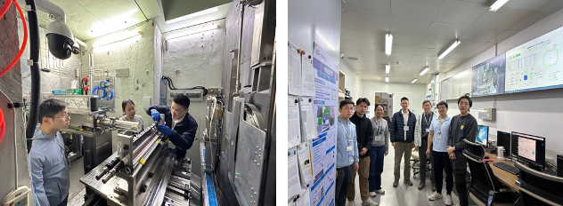

<!--more-->

Following the synchrotron training at SOLEIL, Prof. Yang REN further led local undergraduate student Mr. TO Ho Tak and local Ph.D. student Mr. MAN Ho Fung, together with other Ph.D. students, to conduct electrochemical in-situ and mechanical in-situ neutron experiments at the China Spallation Neutron Source. The experiments investigated structural changes in polymer solid-state electrolytes and alloy materials under electric and mechanical fields. Through hands-on participation in sample preparation, beamline experiments, data collection and preliminary analysis, the local students gained practical experience in large-scale neutron facilities and advanced materials characterization. This training strengthened their research skills and supported the JC STEM Lab's mission of nurturing local STEM talents in energy and materials physics.

