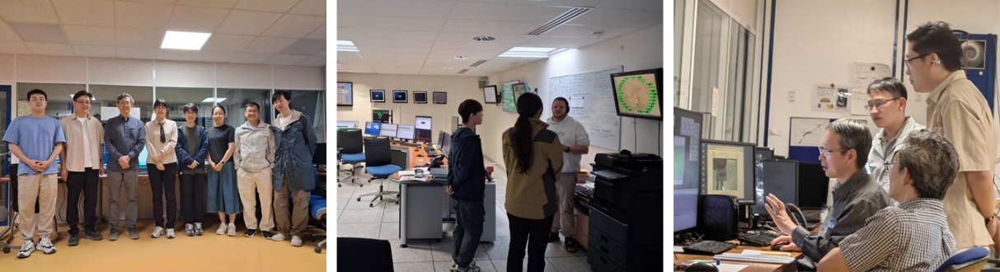

<!--more-->

LUK Ching Hin, an undergraduate student, participated in a research project at the SOLEIL synchrotron in France alongside Prof. Yang REN and other team members. The experimental focus was on utilizing ultra-fast in-situ X-ray absorption spectroscopy to track real-time structural phase transitions and charge transfer dynamics in LiCoO2 cathodes under fast-charging conditions. This hands-on training experience provided direct exposure to advanced synchrotron techniques for studying battery materials under dynamic electrochemical conditions.

