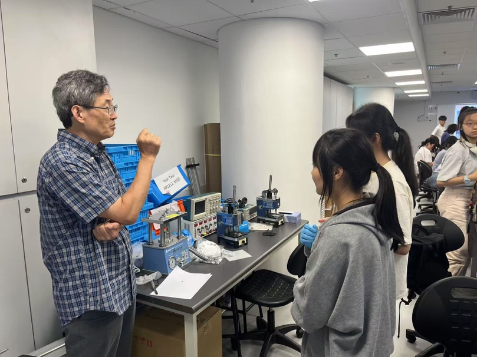

<!--more-->

Two local undergraduate students, Ms. Yeuk Yee Yeung and Mr. Lok Hin Yeung, were brought to the SOLEIL Synchrotron in France for hands-on synchrotron experiments and on-site training. This activity forms part of the Lab's structured training environment that integrates hands-on laboratory work with participation in synchrotron and neutron research projects. Direct engagement with world-class facilities and international research teams significantly broadened the students' technical exposure and deepened their understanding of materials physics beyond classroom-based learning.

