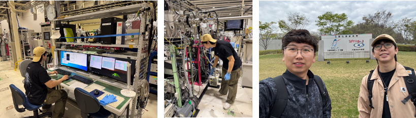

<!--more-->

In addition, the Lab further supported synchrotron soft X-ray experiments at SPring-8 in Japan, led by a postdoctoral researcher from Prof. REN's group with the participation of local Ph.D. student Mr. Leung Chi Hon. The experiments focused on Li-rich cathode materials and solid-state electrolytes, aiming to understand their electronic and structural evolution using advanced synchrotron techniques. Through this hands-on beamline experience, Mr. Leung gained practical training in synchrotron experiment preparation, data collection and preliminary analysis. This activity further enhanced the research capability of local young scientists and contributed to the JC STEM Lab's objective of nurturing local talent in energy and materials physics.

