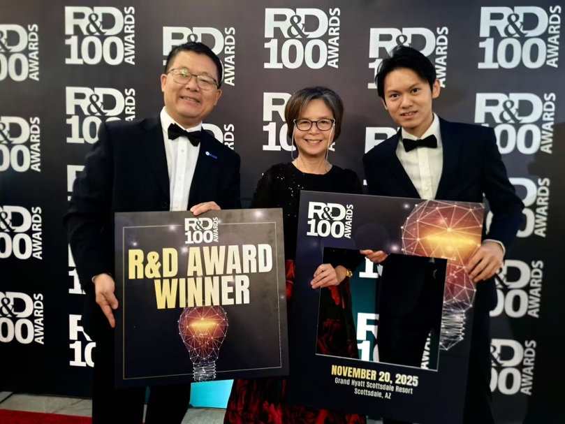

<!--more-->

Another local undergraduate student, Mr. Ho King Yin, was sent to the ISIS Neutron and Muon Source to conduct neutron experiments in collaboration with scientists from the University of Cambridge. The experiment provided direct engagement with world-class facilities and international research teams, significantly broadening the student's technical exposure and deepening his understanding of materials physics beyond classroom-based learning. This activity forms part of the Lab's structured training environment that integrates hands-on laboratory work with participation in synchrotron and neutron research projects.

